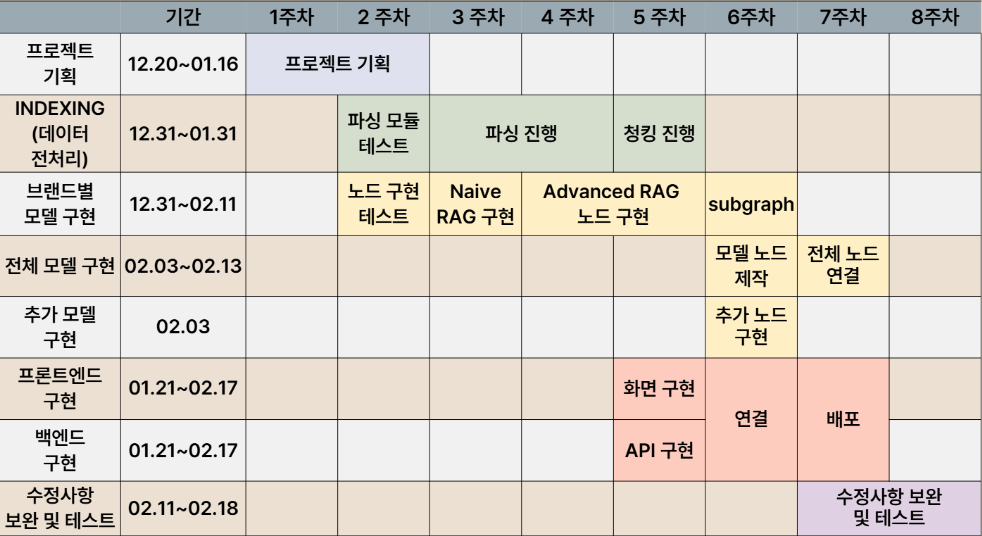
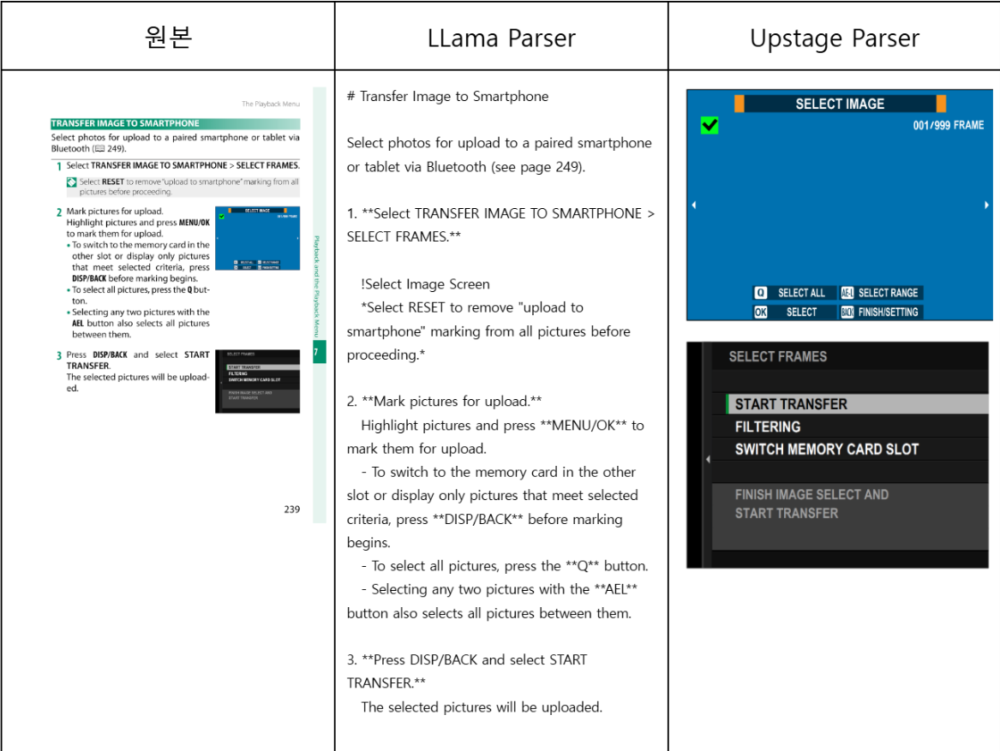

# SKN05-FINAL-1TEAM 
**SKN 5기 최종 단위 프로젝트**
**프로젝트명:** 카메라 사용자 매뉴얼 검색 시스템  
**개발기간:** 2024.12.20 - 2025.02.19  

---

## 📍팀 소개 : CARAGSER📷
- **김요은👩‍💻(팀장)** : 기획, 데이터 전처리, RAG 구현-캐논, 추가 RAG 모델 구현(키워드 추출, 추천질문 생성, Routing 등), 프론트엔드, 문서 작업 

- **장정호👨‍💻**  : 기획, 데이터 전처리, RAG 구현-후지, 키워드 웹검색 모델 구현, 모델 전체 연결(Subgraph연결, 역질문노드 등), 백엔드, 문서 작업 

- **김혜서👩‍💻**  : 기획, 데이터 전처리, RAG 구현-소니, 프롬프트 엔지니어링, 백엔드, 문서 작업

---

### 📑프로젝트 개요
#### 주제 
LLM 활용 내부고객 업무 효율성 향상을 위한 문서 검색 시스템

#### 프로잭트 목표 
- 고객 상담 업무 효율성을 극대화 하기 위해 구매고객을 대상으로 서비스되고 있는 문서의 검색 시스템을 질의 응답(챗봇) 형식으로 구축
- 카메라 사용자의 카메라에 대한 정보 접근성 확대 및 초기 카메라 문제 발생 시 간편 해결 방안 제시로 편의성 증대

#### 프로젝트 기대 효과
- 이미지에 대한 처리 진행으로 검색 시 이미지가 답변에 함께 구현된다는 점에서 의의
- 카메라 시장에서만 활용하지 않고, 이미지가 있는 매뉴얼들의 시스템을 확장 가능성
- 사용자들에게 서비스 추가 제공을 통해 카메라 고객 응대의 퀄리티 증가

---

### 🛠 기술 스택

---
### 🗓 WBS

---
- **시스템 구성도/시스템 아키텍쳐** 
        
        
    
   

---

### 📖 수행결과

 데이터 전처리 

- **수집 데이터** : 카메라 사용자 매뉴얼  
  - 브랜드별 홈페이지에 업로드 되어있는 카메라 사용 매뉴얼 데이터  
  - **활용 브랜드** : 캐논, 소니, 후지필름  

- **파싱**  
  1. **텍스트 파싱**  
     - 사용 도구 : **Llama Parser, PyMuPDF**  
     - **문제점** : 텍스트와 혼용되는 이모티콘이 정상적으로 파싱되지 않음  
     - **해결 방법** : Llama Parser의 **MultiModal 모드**를 활용하여 LLM을 통해 파싱 데이터 수집  
  2. **이미지 파싱**  
     - 사용 Parse : Llama Parser, Upstage Parser
     - Llama Parser를 통해 파싱 데이터에 이미지 위치를 함께 전달
     - Upstage Parser를 통해 PDF 내에서 이미지를 추출하고 크롭하여 저장 

- **청킹 (Chunking)**  
  - 파싱된 데이터 분할 
  - 각 브랜드 모델 별 다른 방식으로 구현
    1. 캐논 : RecursiveCharacterTextSplitter 진행(청크 사이즈 1000, 오버랩 500)
    2. 소니 : page 단위로 데이터 읽음, 청킹 함수(chunk_text) 사용(청킹 사이즈 512, 오버랩 100)
    3. 후지 : GPT-4o의 Context Window 제한 : 128,000토큰, Output Token 제한 : 16,384토큰, 페이지별 청킹된 데이터 사용
 

캐논

1. **Query Expansion** : LLM Generate, 사용자가 입력한 질문을 기반으로 여러 다른 형태의 질문을 생성  
2. **Ensemble Retriever** : VectorDB(의미 기반) + BM25(키워드 기반) 결과를 결합하여 최적의 문서 목록 생성
3. **Filter** :  Ensemble Retriever, Canon 관련성이 떨어지거나 불필요한 정보를 제거  
4. **Reranker** : Cohere Reranking, 검색된 문서 순위를 재조정해 가장 적절한 자료를 상단에 배치  
5. **Generate** : LLM Generate, LLM이 최종 답변(매뉴얼 안내, 문제 해결 가이드 등)을 자연어로 작성  

소니

1. **Query Expansion** : 사용자가 입력한 질문을 기반으로 여러 다른 형태의 질문을 생성  
2. **Ensemble Retriever** : VectorDB(의미 기반) + BM25(키워드 기반) 결과를 결합하여 최적의 문서 목록 생성  
3. **Reranker** : Cohere Reranking, 검색된 문서 순위를 재조정해 가장 적절한 자료를 상단에 배치  
4. **Generate** : LLM Generate, LLM이 최종 답변(매뉴얼 안내, 문제 해결 가이드 등)을 자연어로 작성  

후지

1. **Query Decompose** : 복합적 질의(다중 질문)를 작은 단위로 나누어 처리  
2. **Query Expansion** : Decompose된 질의 각각에 대해서 여러 다른 형태의 질문을 생성  
3. **Hybrid Retriever** : VectorDB + BM25를 결합  
4. **Reranker** : Cohere Reranking, 가장 타당한 문서를 상위에 위치  
5. **Generate** : LLM Generate, 각 소질문 결과를 통합해 답변을 생성  

전체 모델

- **Query Analysis**  
- **Decide Next Step**  
- **Refine Question**  
- **Setting Generate**  
- **Not for Camera**  
- **Subgraph**  
- **Ground Check**  
- **Rewrite Query**  
- **Extract Keyword**  
- **Suggest Question**  

  

결과/시연영상

- [시연영상.mp4](./docs/[SKN 05 1팀] 시연연상.mp4) 

